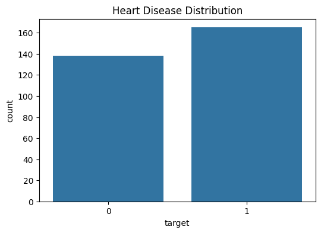

# 🏥 Heart Disease Clinical Prediction Case Study

## 📋 Table of Contents
1. [Project Overview](#project-overview)
2. [Data Preprocessing & Cleaning](#data-preprocessing)
3. [Exploratory Data Analysis (EDA)](#eda)
4. [Feature Engineering](#feature-engineering)
5. [Model Architecture](#model-architecture)

---

## 🔍 1. Project Overview
This project aims to predict heart disease using 13 clinical features. The goal was to build a robust pipeline following OOPs principles and industry-standard documentation.

## ⚙️ 2. Data Preprocessing
- **Handling Missing Values:** Checked for nulls (Found 0 nulls in this dataset).
- **Outlier Detection:** Used Boxplots to identify extreme values in 'Cholesterol' and 'Resting BP'.
- **Data Scaling:** Applied `StandardScaler` to ensure all features (like age vs cholesterol) are on the same scale.

## 📊 3. Exploratory Data Analysis (EDA)
In this phase, we analyzed the hidden patterns in the heart clinical data.

### A. Target Distribution
We checked if the dataset is balanced.
>   
*Insight: The dataset has a healthy balance of disease vs non-disease cases.*

### B. Correlation Analysis
We used a Heatmap to see which medical factors affect the heart the most.
>   
*Insight: Features like 'cp' (chest pain) and 'thalach' (max heart rate) show a strong relationship with the target.*

## 🛠️ 4. Feature Engineering
- **Categorical Encoding:** Converted categorical variables into numerical format using One-Hot Encoding where necessary.
- **Feature Selection:** Analyzed feature importance using the Random Forest 'feature_importances_' attribute.
- **Pipeline Integration:** Bundled the scaling and model steps into a single `sklearn.pipeline.Pipeline` object for cleaner code.

## 🤖 5. Model Architecture (OOPs Based)
The project is structured using Python Classes:
- `HeartPredictor` Class: Handles model initialization and training.
- `DataTransformation` Logic: Embedded within the class to ensure data consistency during prediction.

---
**Project Status:** ✅ Completed  
**Deadline:** 22nd January 2026
